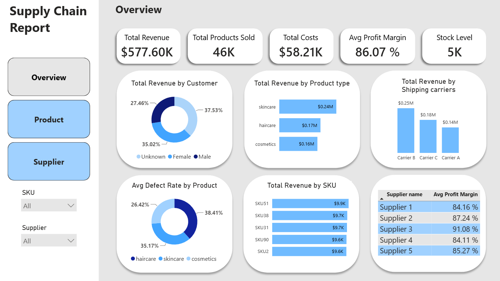
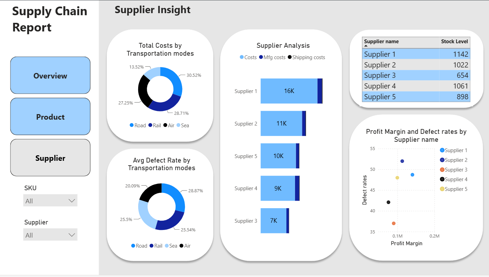

# Supply Chain Dashboard / Power BI
## Introduction
**Company Overview:** Aura Logistics & Cosmetics Co. is a consumer goods corporation that operates within three main product categories, namely Haircare, Cosmetics, and Skincare. It operates a sophisticated **supply chain** consisting of various international suppliers, shipping service providers, and modes of transport including air, rail, road, and sea.

**The Problem:** The data was scattered into one single flat file (supply_chain_data.csv) and thus **limited visibility** for the executives. The corporation was faced with slim profit margins, inventory imbalances, and inconsistency in quality but without knowing the reasons behind them.

**The Aim:** The objective of the project was to consume raw operational data from the company, engineer **key performance indicators**, and create an interactive 3-page Business Intelligence report using **Power BI**.

[View intercative dashboard here on the Power BI Service](https://app.powerbi.com/view?r=eyJrIjoiYTE4NmY4MjYtY2VmOC00YTE2LWJlYjgtZTA4ZGU0M2FlZmJmIiwidCI6IjFlNzI1ZjFjLWFjMjUtNDhmMy04MWJiLWE4YjkzNWVhNWUwMyIsImMiOjh9)
## Skills Showcased
The following project highlights the combination of both **technical skill** sets and knowledge within the **Industrial Engineering** realm:

**Data Engineering & ETL:** Loading flat files, establishing consistent naming conventions, changing data types, and cleansing text through Power Query.

**Business Intelligence (DAX):** Developing business rules that help derive actual profit numbers down to Stock Keeping Units (SKUs).

**UI/UX & Dashboard Structure:** Creating functional layouts with contrasted design, custom navigation bars, custom design borders, and conditional formatting.

**Operations & Analytics:** Combining individual metrics (such as correlating lead time to inventory level) for bottleneck identification.

## Dashboard Overview
### Executive Overview Page
**Focus:** High-level executive monitoring of corporate health.

**Core Metrics:** Displays high-level tracking of Total Revenue, Total Products Sold, Total Costs, Average Profit Margin, and Current Stock Levels using unified KPI cards.

**Visual Elements:** Includes a revenue breakdown by Customer Demographics (Male, Female, Non-binary, Unknown) and Product Types via donut charts, alongside a column chart tracking distribution across individual Shipping Carriers and a horizontal ranking of the Top 5 SKUs by Revenue.

### Product Insights Page
**Focus:** Inventory management and demand-supply alignment.

**Core Metrics:** Evaluates order quantities, storage capacities, and manufacturing timelines.

**Visual Elements:** Features paired column charts comparing current Stock Levels directly against Order Quantities across all 100 SKUs. Includes a clustered column chart contrasting supplier delivery lead times against internal Manufacturing Lead Times, and a scatter plot exploring price elasticity (Price vs. Total Products Sold) categorized by product type.

### Supplier Analytics Page
**Focus:** Quality assurance, risk management, and logistics expenditure.

**Core Metrics:** Dissects vendor performance, defect frequencies, and freight cost allocation.

**Visual Elements:** Features a stacked bar chart breaking down cost compositions (Normal Cost, Manufacturing Cost, Shipping Cost) per supplier. Includes donut charts analyzing total cost distributions and average defect rates across different Transportation Modes. Concludes with an analytical scatter plot correlating supplier Defect Rates directly against net Profit Margins.

## Connecting the Dots: Identifying the Problems
By cross-referencing data points across the three pages, three critical supply chain vulnerabilities were identified:

**The Lead Time-Stock Disconnect:** Several high-revenue SKUs display prolonged manufacturing lead times, yet their current stock levels are dangerously low. This exposes the company to severe stockout risks and unfulfilled customer demand.

**Transportation Cost Inefficiencies:** Analyzing logistics spend reveals that Air freight accounts for an excessively high proportion of total shipping costs. However, Air transit does not yield a significant drop in product defect rates compared to cheaper options like Road or Rail, leading to margin erosion.

**High-Defect Vendor Risks:** The supplier analysis reveals specific vendors operating with average defect rates well above the acceptable baseline. These high defect rates generate hidden costs during the manufacturing phase, heavily penalizing the net margins of finished goods.

## Action Plan: Supply Chain Optimization
To resolve these operational bottlenecks and stabilize the company's bottom line, the following three-phase action plan has been formulated:

**Short-Term (Immediate):** Inventory Buffer Stabilization
Establish dynamic safety stock levels for the top 5 revenue-generating SKUs. Readjust reorder points for items where internal manufacturing timelines exceed standard supplier delivery windows to ensure continuous fulfillment.

**Medium-Term (3–6 Months):** Freight Mode Rationalization
Transition non-urgent, heavy-volume SKU shipments from high-cost Air freight to more economical modes like Road or Rail. Re-negotiate shipping contracts to establish clear, performance-linked freight rates.

**Long-Term (6+ Months):** Supplier Quality Assurance (QA) Integration
Implement a strict vendor scorecard program. Suppliers consistently exceeding the maximum allowable defect threshold will be placed on a corrective improvement timeline or systematically phased out in favor of higher-quality, higher-margin alternatives.

## Conclusion
This project has shown how the conversion of raw operational data into **business intelligence data** can help reveal **supply chain** weaknesses. We cleaned the supply_chain_data.csv file using Power Query and developed a very coherent 3-page **Power BI report**. In doing this, we have gone from simply gathering data to analyzing the operations of the business, thereby putting into action the proposed optimization strategy that will enable the firm to plug any **leaks of profit** and save itself from **losses**.